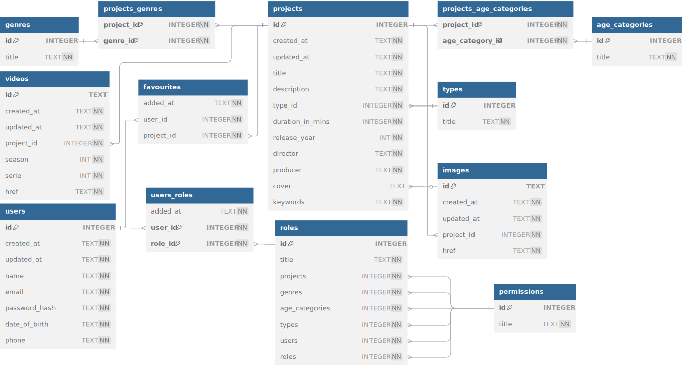

# Ozinshe

Для логина используй:
* логин: `admin@admin.com`
* пароль: `admin`

Личная онлайн-платформа, предоставляющая информацию о фильмах. Система позволяет оценивать фильмы, помечать фильмы 
просмотренными и формировать очередь просмотра.

## `swag`

## DataBase

## References

1. [svg to png](https://svgtopng.com/)
2. [Database schema](https://www.dbdiagram.io/d/ozinshe-68132c1f1ca52373f5132a27)